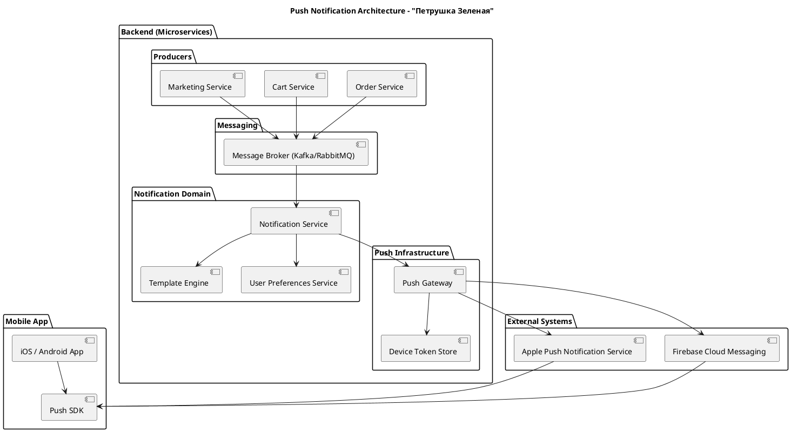

Я составила схему верхнеуровневой архитектуры PUSH-уведомлений для микросервисной системы интернет-магазина "Петрушка Зеленая".

### Источники событий (Producers)
Это микросервисы, где происходят события: Order Service — действия с заказом, Cart Service — действия с корзиной и её состояния, Marketing Service — рассылка.

### Message Broker
Например: Kafk, RabbitMQ

### Notification Service
Главный сервис, который: подписывается на события, решает кому отправлять, формирует сообщение, выбирает канал.

### Push Gateway
Сервис-адаптер к внешним платформам.

